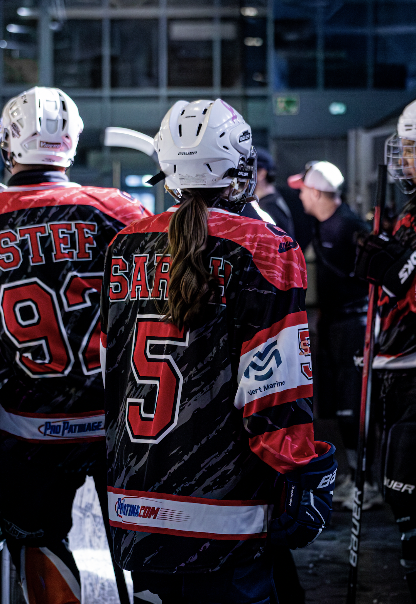

## Introduction

This repository is used to learn by doing the basics of Git and GitHub.

Before this assignment, I had no experience with Git or GitHub. I am discovering these tools for the first time and learning how repositories, branches, commits and pushes work.

I am looking forward to learning more about Git and GitHub and understanding how I can use them for my future projects in data analysis and programming.

## Image

## My motivation

I want to learn how to code and analyze data for my future career.
My goal is to work in professional sport, not only as a strength and conditioning coach but also with data.
I want to understand athletes' data and use it to make my work more precise.
I also want to be able to compare athletes and better understand what the numbers mean.
Finally, I want to present data clearly so that it is useful for both the staff and the athletes.

## Local image

## What I learned

- I learned how to create and use a GitHub repository.
- I learned how to create a branch, make commits and push my changes to GitHub.
- I learned how to modify a README file and see the link between my local changes and the repository online.
- I learned how to add an image from a URL to a README file.
- I learned how to add an image from my computer using a local folder and a relative path.

## Conclusion

This assignment took me approximately 1 hour to complete.